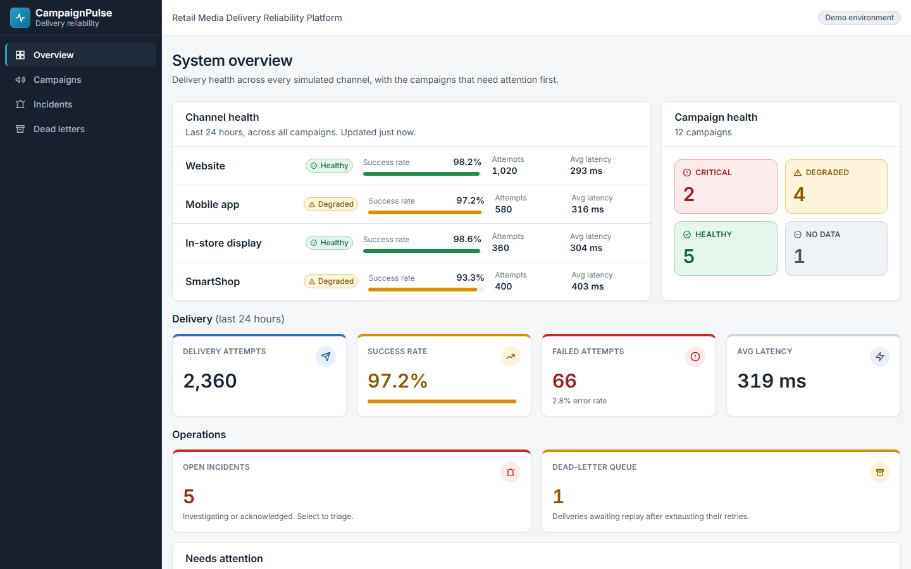
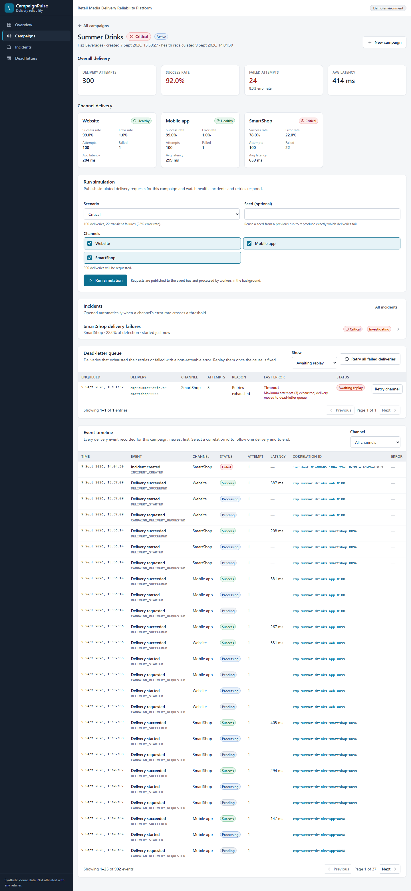
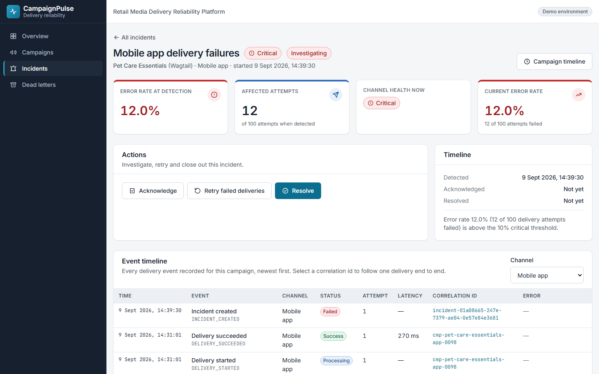
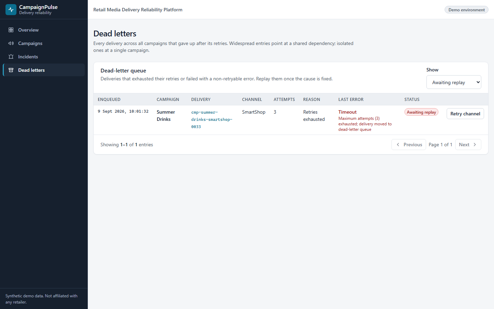
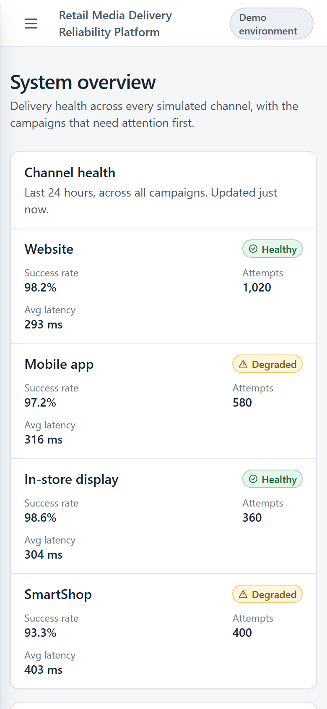
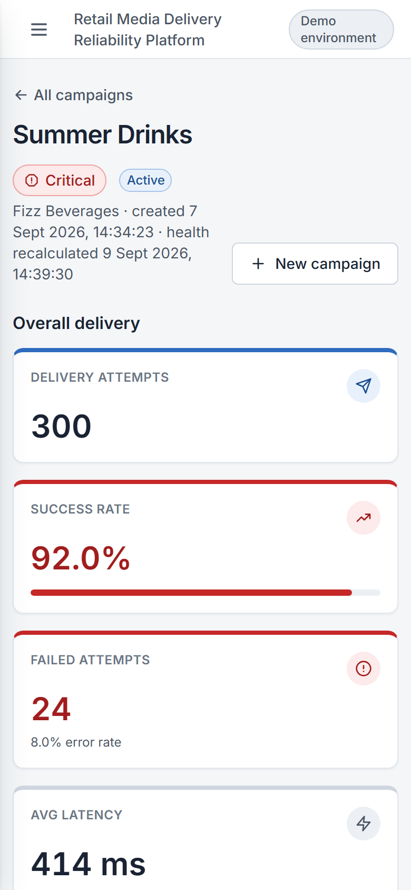

# CampaignPulse

**Retail Media Delivery Reliability Platform.** Monitor, detect and investigate failures across
distributed campaign delivery systems.

CampaignPulse is a portfolio engineering project. It explores the reliability, observability,
event-driven processing and incident-management patterns needed to operate omnichannel retail
media delivery at scale: one campaign, delivered to a website, a mobile app, in-store screens and
self-scan devices, each of which can fail independently.

> **What this is not.** CampaignPulse is not affiliated with any retailer or retail media
> network. It is not a clone of, or a replacement for, any production system, and it makes no
> claims about how any real platform is built or how reliable it is. All campaigns, advertisers
> and delivery events are synthetic.

## Screenshots

| Overview                                                                                                    | Campaign detail                                                                                                                   |
| ----------------------------------------------------------------------------------------------------------- | --------------------------------------------------------------------------------------------------------------------------------- |
|  |  |

| Incident                                                                                             | Dead-letter queue                                                   |
| ---------------------------------------------------------------------------------------------------- | ------------------------------------------------------------------- |
|  |  |

<details>
<summary>Mobile</summary>

| Overview                                                     | Campaign detail                                                            |
| ------------------------------------------------------------ | -------------------------------------------------------------------------- |
|  |  |

</details>

## The problem it models

A campaign is delivered to several channels. Some deliveries succeed, some time out, some are
retried, and some end up in a dead-letter queue. The engineering team needs to answer, quickly:

- Which channel failed, and when?
- How many deliveries failed, and is the failure isolated or widespread?
- How long is delivery taking?
- Has the system retried, and did the retry work?
- Is the service healthy, degraded or critical right now?

## Features

- **System overview**: per-channel health over a rolling window, campaign health counts,
  delivery metrics (attempts, success rate, failures, average latency), open incidents, the
  dead-letter queue depth, and the campaigns that need attention first.
- **Campaign list**: search, filter by health and channel, sort, paginate. Filters live in the
  URL so a view can be shared. Cards flag open incidents and dead-lettered deliveries.
- **Campaign detail**: overall metrics, per-channel delivery health, the simulation control, the
  campaign's incidents, its dead-letter queue, and an event timeline with channel filtering and
  click-to-follow correlation ids that trace one delivery end to end (requested → started →
  failed → retry → succeeded).
- **Delivery simulation** through an event bus: deterministic scenarios (healthy, degraded,
  critical, retry that succeeds, retries exhausted, non-retryable) or a custom volume and
  failure rate, reproducible from a seed. Workers process the queue asynchronously; the UI polls.
- **Retries and dead-letter queue**: three attempts with exponential backoff for transient
  errors, immediate dead-lettering for request faults, and replay from the UI once the cause is
  fixed. Processing is idempotent under duplicate delivery and safe under concurrent workers.
- **Incidents**: opened automatically when a channel crosses the degraded or critical threshold
  on a meaningful sample, escalated when it worsens, acknowledged and resolved by an operator,
  with every step on the timeline and a notification on each change.
- **Create campaign** with validation shared between the form and the API.
- **Deterministic demo data** covering every scenario, including seeded incidents and a
  dead-lettered delivery.
- **Structured logging** (JSON lines with request and correlation ids) and typed configuration.
- **AWS deployment**: Lambda functions behind API Gateway and SQS, an SQS dead-letter queue, SNS
  notifications, Secrets Manager, and CloudWatch logs, metric filters, alarms and a dashboard,
  provisioned with Terraform (the Serverless Framework is supported as an alternative for the
  functions).

## Architecture at a glance

```
apps/web  (React 19, Vite, TanStack Query, Tailwind)
   │  GraphQL over HTTP (typed documents generated from the schema)
   ▼
apps/api  (Node.js, GraphQL Yoga)
   ├─ graphql/      thin resolvers: validate arguments, call a service
   ├─ services/     campaigns, simulation, incidents, dead letters, health, metrics
   ├─ processing/   DeliveryProcessor: attempts, retries, idempotency, transitions
   ├─ events/       EventBus interface + LocalEventBus (SQS semantics, in process)
   ├─ aws/          SqsEventBus, SnsNotificationPublisher, Secrets Manager
   ├─ lambda/       graphql, deliveryWorker and deadLetterConsumer handlers
   └─ Prisma ──▶ PostgreSQL
packages/
   ├─ event-contracts   the delivery event schema, simulation params and enums (Zod)
   ├─ shared            health, metrics, retry policy, state machine, incident rules
   └─ design-tokens     semantic design tokens → Tailwind theme
infrastructure/
   ├─ terraform         queues, topic, secret, observability, hosting, RDS, Lambda, API Gateway
   └─ serverless        optional Serverless Framework deployment of the functions
```

Locally one Node process hosts the API and the worker on an in-memory bus with SQS semantics;
in AWS the same code runs as three Lambda functions joined by SQS. Health is **persisted**
(recalculated after every processed batch) while delivery metrics are **computed on read** from
the event table. See [docs/architecture.md](docs/architecture.md), the decision log in
[docs/decisions.md](docs/decisions.md) and [docs/aws-deployment.md](docs/aws-deployment.md).

## Getting started

Prerequisites: Node.js 22.12 or later (24 recommended) and Docker Desktop for PostgreSQL. No cloud
credentials are needed; everything runs locally.

```bash
npm install
cp apps/api/.env.example apps/api/.env   # PowerShell: Copy-Item apps/api/.env.example apps/api/.env
npm run codegen                           # Prisma client + GraphQL types
npm run db:up                             # PostgreSQL 17 in Docker
npm run db:migrate                        # apply migrations
npm run db:seed                           # load the demo scenarios
npm run dev                               # API on :4000, web on :5173
```

Then open http://localhost:5173. GraphiQL is available at http://localhost:4000/graphql.

`npm run setup` runs the codegen, database and seed steps in one go. To see the pipeline in
motion, open any campaign and run the **Critical** scenario from the scenario runner: within seconds the channel turns
critical, an incident opens, and the timeline fills with retries.

The integration and end-to-end tests need a database too: set `DATABASE_URL_TEST` in
`apps/api/.env` to a second database (the suite wipes it) and run `npm test`; run
`npm run test:e2e` with the dev servers up, or let Playwright start them.

The Docker container is published on host port 5433 so it never collides with a PostgreSQL
service that may already be installed on the machine. To use an existing server instead, create
a database and role for the project and point `DATABASE_URL` in `apps/api/.env` at it:

```sql
CREATE ROLE campaignpulse WITH LOGIN PASSWORD 'campaignpulse';
CREATE DATABASE campaignpulse OWNER campaignpulse;
```

## Scripts

| Script                      | What it does                                                  |
| --------------------------- | ------------------------------------------------------------- |
| `npm run dev`               | Starts the API and the web app together                       |
| `npm run codegen`           | Generates the Prisma client and GraphQL types for API and web |
| `npm run db:up` / `db:down` | Starts / stops PostgreSQL via Docker Compose                  |
| `npm run db:migrate`        | Applies Prisma migrations to the local database               |
| `npm run db:seed`           | Replaces all data with the deterministic demo set             |
| `npm run db:reset`          | Drops, recreates, migrates and seeds the database             |
| `npm run db:studio`         | Opens Prisma Studio                                           |
| `npm run lint`              | ESLint (TypeScript, React hooks, accessibility rules)         |
| `npm run format:check`      | Prettier                                                      |
| `npm run typecheck`         | `tsc --noEmit` in every workspace                             |
| `npm test`                  | Unit, component and database integration tests (Vitest)       |
| `npm run test:e2e`          | End-to-end tests (Playwright) against the running stack       |
| `npm run build`             | Production build of the web app and generated theme CSS       |
| `npm run build:lambda`      | Bundles the three Lambda handlers with esbuild                |

## Project structure

```
apps/api            GraphQL API, worker, Lambda handlers, Prisma schema, migrations and seed
apps/web            React application
packages/event-contracts
packages/shared
packages/design-tokens
infrastructure/     Terraform (platform) and Serverless Framework (functions)
tests/e2e           Playwright end-to-end tests
docs/               architecture, decision log, demo scenarios, AWS deployment
.github/workflows   continuous integration and manual deployment
```

## Demo assumptions

- **Health thresholds.** Error rate below 2% is healthy, 2% to below 10% is degraded, 10% or
  above is critical, and zero events is "no data" rather than "0% success". These thresholds are
  chosen to make the demo scenarios legible; they are not derived from any real operator's
  service levels.
- **Channels.** `WEB`, `MOBILE_APP`, `IN_STORE_DISPLAY` and `SMARTSHOP` are simulated surfaces,
  not integrations with real systems.
- **Metrics.** Each delivery attempt produces exactly one outcome. Success and error rates are
  per attempt, so a delivery that fails twice and succeeds on the third try counts as two
  failures and one success. See [docs/decisions.md](docs/decisions.md) for the full semantics.
- **Retry policy.** Three attempts with 0 s, 5 s and 30 s backoff. Timeouts, network errors,
  unavailable dependencies, rate limiting and unknown errors are retried; validation and
  authorization errors are not. Locally the backoff is compressed by `RETRY_BACKOFF_SCALE`.
- **Incident detection.** An incident opens only once a channel has at least 100 recorded
  attempts and its error rate is above a threshold, so a single early failure never pages
  anyone. Resolution is a human action.

## Roadmap

| Phase | Scope                                                              | Status  |
| ----- | ------------------------------------------------------------------ | ------- |
| 0     | Monorepo, tooling, database, CI                                    | Done    |
| 1     | Overview, campaign list and detail, schema, GraphQL API            | Done    |
| 2     | Event contracts in motion: local event bus, delivery simulation    | Done    |
| 3     | Automatic incident detection and incident management               | Done    |
| 4     | Retry policy, exponential backoff, dead-letter queue               | Done    |
| 5     | End-to-end tests (Playwright) and database integration tests       | Done    |
| 6     | AWS: Lambda, SQS with DLQ, SNS, CloudWatch, infrastructure as code | Done    |
| 7     | Polish: responsive and accessibility passes, screenshots           | Planned |

## Live deployment

The `dev` stage runs on AWS in `eu-west-2`: Lambda functions behind API Gateway, SQS with a
dead-letter queue, SNS, RDS PostgreSQL, Secrets Manager, CloudWatch, and the web app on
CloudFront. It is torn down when not being demonstrated to keep costs at zero, so the URL may be
offline: https://d2tg6k6wy891qy.cloudfront.net. The whole environment is recreated with one
command from AWS CloudShell or one GitHub Actions run; see the
[deploy runbook](docs/deploy-runbook.md).

## Documentation

- [Architecture](docs/architecture.md)
- [Decision log](docs/decisions.md)
- [Demo scenarios](docs/demo-scenarios.md)
- [AWS deployment](docs/aws-deployment.md)
- [Deploy runbook](docs/deploy-runbook.md): GitHub Actions with OIDC, no access keys
