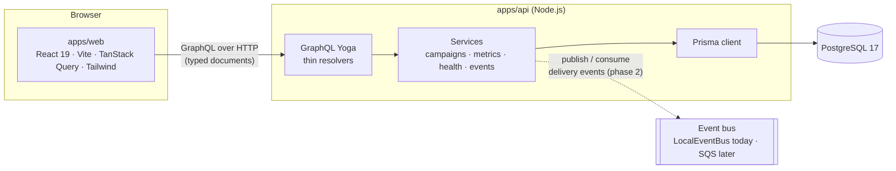
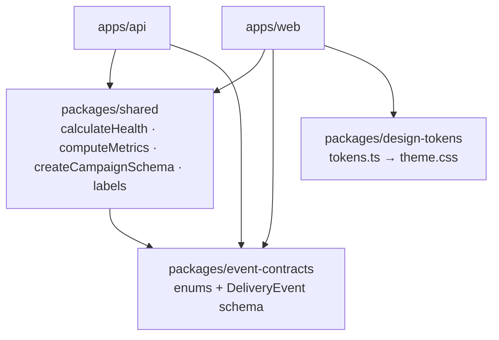

# Architecture

CampaignPulse is a monorepo with two applications and three internal packages. The applications
never share code directly; anything both need lives in a package.

## System context

## Packages

- **event-contracts** is the vocabulary: channels, event types, event statuses, error codes,
  health and campaign statuses, and the `DeliveryEvent` shape every producer and consumer agrees
  on. The Prisma enums and the GraphQL enums mirror these lists, and a test enforces parity.
- **shared** holds pure domain logic with no I/O, so it is trivially unit-tested and identical on
  both sides of the network: health classification, metric semantics and input validation.
- **design-tokens** is the single source of truth for colour, type, spacing and layout. A small
  generator renders it as a Tailwind `@theme` block; a test fails if the generated CSS drifts.

## Request flow

1. The web app issues a GraphQL operation defined in `apps/web/src/api/queries.ts`. GraphQL Code
   Generator has already checked the document against the schema and produced its result type.
2. Yoga builds a per-request context: a Prisma client, a child logger carrying `requestId` (and
   `correlationId` if the caller sent one) and the service graph.
3. A resolver validates arguments with Zod (`apps/api/src/graphql/args.ts`) and calls exactly one
   service method.
4. Services run the business logic and talk to PostgreSQL through Prisma. Domain errors
   (`NotFoundError`, `ValidationError`) carry a machine-readable code that the error-masking
   layer passes through to clients; anything unexpected is logged with its stack and masked.
5. One structured log line records the operation name, duration and error count.

## Data model

| Table               | Purpose                                                                     |
| ------------------- | --------------------------------------------------------------------------- |
| `campaigns`         | Campaign identity, lifecycle status and its **persisted** overall health.   |
| `campaign_channels` | One row per campaign × channel with its persisted health.                   |
| `delivery_events`   | Append-only timeline. `correlation_id` links every event of one delivery.   |
| `incidents`         | Detected reliability incidents (populated from phase 3).                    |
| `processed_events`  | Idempotency ledger of event ids that have already been processed (phase 2). |

Health is written by `HealthService` whenever a campaign's events change (after seeding today;
after every processed batch once the event pipeline exists). Metrics are never stored: the
`MetricsService` aggregates them from `delivery_events` with one grouped query per request.

Constraints that the database, not the application, enforces: non-empty campaign names, name
length, `attempt >= 1`, non-negative latency, one row per campaign and channel, valid enum values,
and cascading deletes from campaigns to their channels, events and incidents.

## Observability

Every log line is a JSON object. The fields that matter for debugging a delivery are first-class:
`requestId`, `correlationId`, `campaignId`, `channel`, `errorCode`, `previousHealth`,
`currentHealth`. In development the same lines are rendered by `pino-pretty`; in production they
are emitted as-is so a log aggregator can index them.

## Local development without cloud credentials

Everything runs on a laptop: PostgreSQL in Docker, the API on Node with `tsx`, the web app on
Vite with a dev proxy so the browser stays same-origin. The event bus is an interface with a
local implementation; the SQS implementation is added only when the application is deployed.
