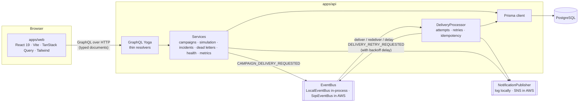
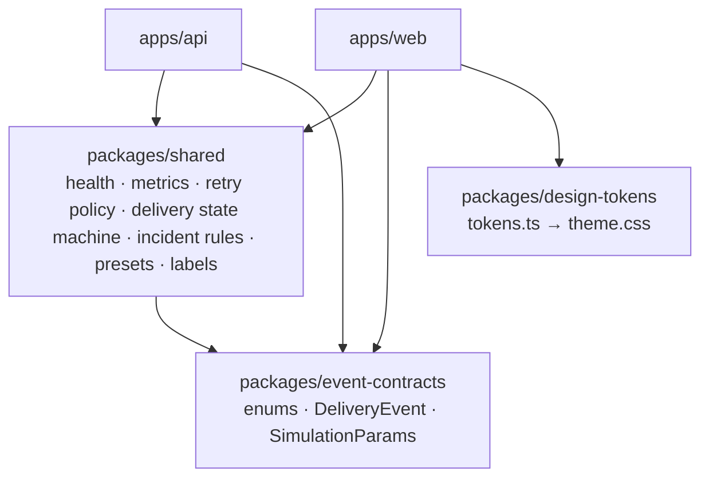
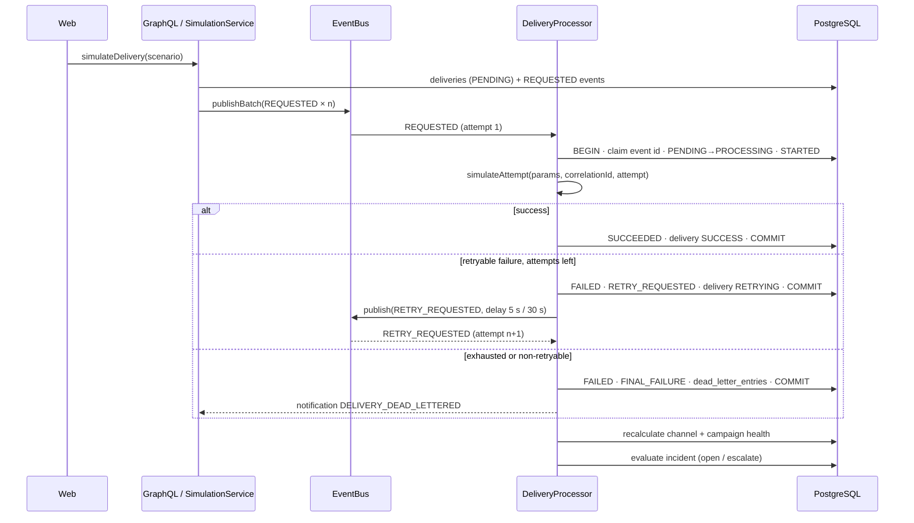

# Architecture

CampaignPulse is a monorepo with two applications and three internal packages. The applications
never share code directly; anything both need lives in a package. The same application code runs
in two shapes: one Node process locally (API plus an in-process worker) and three Lambda
functions in AWS joined by SQS.

## System context

## Packages

- **event-contracts** is the vocabulary: channels, event types and statuses, error codes, health
  and campaign statuses, the `DeliveryEvent` every producer and consumer agrees on, and the
  simulation parameters that travel in event metadata. The Prisma enums and the GraphQL enums
  mirror these lists; a test enforces parity.
- **shared** holds pure domain logic with no I/O, identical on both sides of the network: health
  classification, metric semantics, the retry policy (`decideRetry`), the delivery status
  transition table, the incident rules (severity and minimum volume), simulation presets and
  input validation.
- **design-tokens** is the single source of truth for colour, type, spacing and layout, rendered
  as a Tailwind `@theme` block by a small generator.

## Delivery pipeline

What makes the pipeline safe to run more than once, out of order, or in parallel:

| Property        | Mechanism                                                                                                    |
| --------------- | ------------------------------------------------------------------------------------------------------------ |
| Idempotent      | The event id is claimed in `processed_events` inside the transaction that records the outcome.               |
| Race-safe       | Status moves are `UPDATE deliveries ... WHERE status IN (allowed)`; a stale message updates zero rows.       |
| Bounded         | `decideRetry` allows three attempts with 0 s / 5 s / 30 s backoff and never retries request faults.          |
| Traceable       | Every event of one delivery shares a correlation id; replays get a new id linked to the original.            |
| One incident    | A partial unique index allows one unresolved incident per campaign channel, whatever the worker concurrency. |
| Alert on volume | Incidents open only once a channel has 100 recorded attempts, so early noise never pages anyone.             |

## Request flow

1. The web app issues a GraphQL operation defined in `apps/web/src/api/queries.ts`. GraphQL Code
   Generator has already checked the document against the schema and produced its result type.
2. Yoga builds a per-request context: a Prisma client, a child logger carrying `requestId` (and
   `correlationId` if the caller sent one), the event bus, the notification publisher and the
   service graph.
3. A resolver validates arguments with Zod (`apps/api/src/graphql/args.ts`) and calls exactly one
   service method.
4. Services run the business logic and talk to PostgreSQL through Prisma. Domain errors
   (`NotFoundError`, `ValidationError`) carry a machine-readable code that the error-masking
   layer passes through to clients; anything unexpected is logged with its stack and masked.
5. One structured log line records the operation name, duration and error count.

## Data model

| Table                 | Purpose                                                                                          |
| --------------------- | ------------------------------------------------------------------------------------------------ |
| `campaigns`           | Campaign identity, lifecycle status and its **persisted** overall health.                        |
| `campaign_channels`   | One row per campaign × channel with its persisted health.                                        |
| `delivery_events`     | Append-only timeline. `correlation_id` links every event of one delivery or incident.            |
| `deliveries`          | Current status, attempt count and simulation parameters per correlation id; transitions guarded. |
| `incidents`           | Detected reliability incidents with the error rate and volume at detection and their resolution. |
| `dead_letter_entries` | Deliveries that gave up: why, the last error, and whether they were replayed (and as what).      |
| `processed_events`    | Idempotency ledger of event ids that have been processed.                                        |

Health is written by `HealthService` after every processed batch and after seeding. Metrics are
never stored: the `MetricsService` aggregates them from `delivery_events` with one grouped query
per request.

Constraints the database, not the application, enforces: non-empty names, name length,
`attempt >= 1`, non-negative latency, error code and message present together, one row per
campaign and channel, one unresolved incident per campaign channel, valid enum values, and
cascading deletes from campaigns to everything that references them.

## Local and AWS shapes

| Concern         | Local (`npm run dev`)                         | AWS (see docs/aws-deployment.md)                     |
| --------------- | --------------------------------------------- | ---------------------------------------------------- |
| API             | Node HTTP server hosting GraphQL Yoga         | Lambda `graphql` behind API Gateway (HTTP API)       |
| Transport       | `LocalEventBus`: async, at-least-once, delays | SQS queue with `DelaySeconds`; DLQ via redrive       |
| Worker          | Same process, `LOCAL_BUS_CONCURRENCY` workers | Lambda `deliveryWorker`, batches of 10               |
| Poison messages | Bus callback → `dead_letter_entries`          | SQS DLQ → Lambda `deadLetterConsumer`                |
| Notifications   | Structured log lines                          | SNS topic with filterable attributes                 |
| Secrets         | `apps/api/.env`                               | Secrets Manager, read once per execution environment |
| Observability   | `pino-pretty` in the terminal                 | CloudWatch logs, metric filters, alarms, dashboard   |

## Observability

Every log line is a JSON object. The fields that matter for debugging a delivery are first-class:
`requestId`, `correlationId`, `campaignId`, `channel`, `errorCode`, `attempt`, `previousHealth`,
`currentHealth`, `incidentId`. Three messages are stable enough to be metrics in CloudWatch:
`incident created`, `delivery dead-lettered` and `delivery attempt failed`.

## Local development without cloud credentials

Everything runs on a laptop: PostgreSQL in Docker (or any local server), the API and worker in
one Node process with `tsx`, the web app on Vite with a dev proxy so the browser stays
same-origin. The event bus and notification publisher are interfaces; their AWS implementations
are only constructed inside the Lambda runtime.
