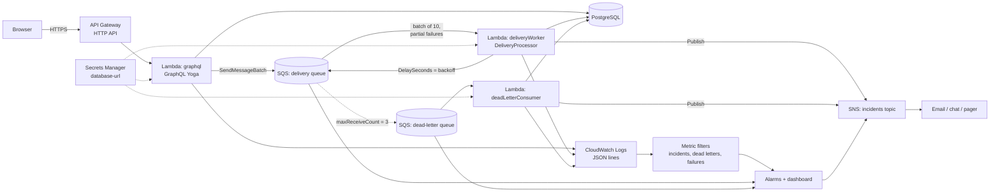

# AWS deployment

The local stack and the AWS stack run the same application code. Locally the API process hosts
an in-memory event bus and the worker; in AWS the pieces are separate Lambda functions joined by
SQS, with SNS for alerting, Secrets Manager for the database credential and CloudWatch for logs,
metrics, alarms and a dashboard.



## Ownership

Terraform (`infrastructure/terraform`) provisions everything by default: queues and the redrive
policy, the SNS topic, the Secrets Manager secret, log groups, metric filters, alarms, the
dashboard, S3 + CloudFront for the web app, the optional RDS instance, and the three Lambda
functions with their execution role, SQS event source mappings and the API Gateway HTTP API
(`functions.tf`). One tool, one state, no third-party accounts.

The Serverless Framework configuration in `infrastructure/serverless` is an alternative for the
functions only: set `manage_functions = false` in Terraform, and `serverless.yml` reads the
queue, topic and secret identifiers Terraform publishes to SSM Parameter Store
(`/campaignpulse/<stage>/...`). Log groups stay with Terraform either way so metric filters can
reference them.

## Runtime wiring

- `apps/api/src/lambda/runtime.ts` builds the service graph once per execution environment:
  resolves `DATABASE_URL` from Secrets Manager (cached), creates the Prisma client, the
  `SqsEventBus` and `SnsNotificationPublisher`, and the same `DeliveryProcessor` the local server
  uses.
- `graphql.ts` adapts API Gateway v2 events to the Fetch API `Request`/`Response` that GraphQL
  Yoga speaks.
- `delivery-worker.ts` consumes batches of up to 10 events, returns partial batch failures so only
  the failed messages return to the queue, and evaluates health and incidents once per touched
  campaign channel after the batch.
- `dead-letter-consumer.ts` records messages the worker gave up on (after `maxReceiveCount`) and
  raises a notification.

Retry backoff maps directly onto SQS: a retry is a new message published with `DelaySeconds`
(5 s, then 30 s). Poison messages, ones the worker cannot process at all, are the queue's problem
and land in the dead-letter queue through the redrive policy; both paths end up in the same
`dead_letter_entries` table the UI shows.

## Bundling

`npm run build:lambda` runs `apps/api/scripts/build-lambda.ts`, which uses esbuild to produce one
ESM file per function under `infrastructure/serverless/.build/`. The Prisma 7 client embeds its
query compiler as a base64 module, so the bundle needs no native binaries or extra assets. The
GraphQL SDL is inlined at codegen time (`scripts/inline-schema.ts`) for the same reason.

The bundled GraphQL handler can be exercised locally without AWS by invoking it with an API
Gateway event and `DATABASE_URL` set; the repository's CI does this implicitly by building the
bundles on every push.

## Deploying

The recommended route is the GitHub Actions workflow described step by step in
[deploy-runbook.md](deploy-runbook.md): no access keys are created anywhere. The manual route
below does the same from a machine with AWS credentials configured.

Prerequisites: an AWS account with the bootstrap stack applied (it creates the Terraform state
bucket), Terraform 1.10+ and Node.js 22+.

```bash
# 1. Platform (state lives in the bucket the bootstrap stack creates)
cd infrastructure/terraform
cp terraform.tfvars.example terraform.tfvars   # set database_url or create_database = true
terraform init \
  -backend-config="bucket=campaignpulse-terraform-state-<account id>" \
  -backend-config="key=campaignpulse/dev.tfstate" \
  -backend-config="region=eu-west-2"
terraform apply

# 2. Database schema (from the repository root, against the same database)
DATABASE_URL="postgresql://..." npx prisma migrate deploy --schema apps/api/prisma/schema.prisma

# Terraform deployed the functions from the bundles built by `npm run build:lambda`
# (run it before `terraform apply`). To use the Serverless Framework instead:
#   terraform apply -var manage_functions=false
#   cd ../serverless && npx serverless@4 deploy --stage dev --region eu-west-2
```

The GraphQL endpoint is the `api_url` Terraform output. Build the web app against it
with `VITE_GRAPHQL_URL=<endpoint>/graphql npm run build -w apps/web` and sync `apps/web/dist` to
the S3 bucket Terraform created (`web_bucket` output); CloudFront serves it with SPA routing.
API Gateway CORS is enabled for that purpose.

`.github/workflows/deploy.yml` runs the same steps, plus building and publishing the web app to
S3 and CloudFront, authenticating to AWS with GitHub OIDC; `destroy.yml` tears a stage down.

## Database options

`create_database = false` (default) expects `database_url` to point at any reachable PostgreSQL:
RDS, Aurora, or a hosted provider. `create_database = true` provisions a `db.t4g.micro`
PostgreSQL 17 instance in the default VPC. The Lambda functions run outside a VPC (so they can
reach SQS, SNS and Secrets Manager without NAT or endpoints), which means the database must be
reachable from the public internet, restricted by `database_allowed_cidrs` and TLS. A production
posture would put the functions in private subnets with VPC endpoints and an RDS Proxy; that is
deliberately out of scope here.

## What CloudWatch shows

- **Log groups** per function with JSON lines carrying `requestId`, `correlationId`,
  `campaignId`, `channel`, `errorCode`, `previousHealth` and `currentHealth`.
- **Metric filters** turning three log messages into metrics: `IncidentsCreated`,
  `DeliveriesDeadLettered` and `DeliveryAttemptFailures` (namespace `CampaignPulse/<stage>`).
- **Alarms**: dead-letter queue not empty, delivery worker errors, and delivery queue backlog
  (oldest message older than five minutes). All notify the incidents topic.
- **Dashboard** with delivery outcomes, queue depths (including delayed retries), invocations and
  p95 durations.

## Cost

With `create_database = false`, everything provisioned is inside the AWS free tier at demo
volumes: SQS, SNS, Lambda, API Gateway, Secrets Manager (one secret, ~$0.40/month) and CloudWatch
(one dashboard, three alarms). RDS adds roughly $12/month for `db.t4g.micro` outside the free
tier. `terraform destroy` and `serverless remove` tear everything down.
